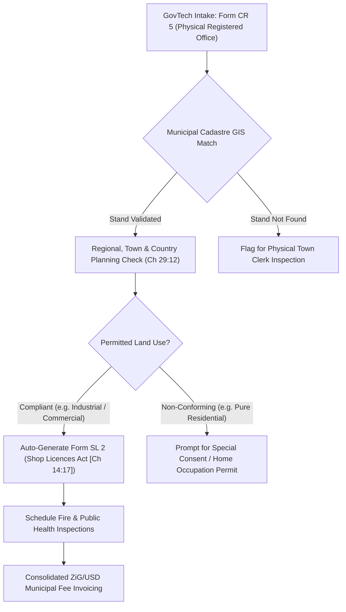

# MUNICIPAL PILOT PROPOSAL: INTEGRATED ZONING & SHOP LICENSING
## Bridging National Company Incorporation with Local Authority Permitting
**Target Local Authorities:** City of Harare (Urban Council) & Ruwa Local Board  
**Statutory Framework:**  
- Companies and Other Business Entities (COBE) Act [Chapter 24:31]  
- Urban Councils Act [Chapter 29:15]  
- Shop Licences Act [Chapter 14:17]  
- Regional, Town and Country Planning Act [Chapter 29:12]  
- Public Health Act [Chapter 15:17]  

---

### 1. EXECUTIVE SUMMARY & STRATEGIC RATIONALE

Historically in Zimbabwe, establishing a physical commercial enterprise requires two disconnected bureaucratic processes:
1. **National Incorporation (CIPZ):** Incorporating the legal entity under the COBE Act [Chapter 24:31].
2. **Municipal Licensing (Local Authority):** Applying for planning zoning clearance and a Municipal Shop Licence under the Shop Licences Act [Chapter 14:17] and Urban Councils Act [Chapter 29:15].

Entrepreneurs face severe delays (often exceeding 60-90 days) traveling between central government offices and municipal district housing offices, leading to widespread informal trading and municipal revenue leakages.

This pilot proposal outlines an automated data bridge that connects the ZimGov-MVP statutory platform directly to municipal cadastres, allowing entrepreneurs who complete their Form CR 5 (Registered Office) to instantaneously obtain:
- **Automated Stand & Cadastre GIS Verification**
- **Town Planning Zoning Clearance** (Industrial, Commercial, Mixed Use)
- **Municipal Form SL 2 (Application for Shop Licence)** Pre-population
- **Consolidated Dual-Currency Billing (ZiG & USD)**

---

### 2. CROSS-STATUTORY WORKFLOW

---

### 3. STATUTORY COMPLIANCE MODULES

#### 3.1 Module 1: Form CR 5 to Municipal Stand Cadastre Mapping
- **Statutory Link:** COBE Act Section 112 mandates a physical street address within Zimbabwe.
- **Municipal Verification:** The platform validates street address descriptions against Harare City Council cadastre records (e.g., *Stand 412, Workington Industrial Area, Paisley Road*).
- **Zoning Classification:** Automatic check against the Harare Master Plan and Ruwa Outline Master Plan to verify whether the business activities specified in Form CR 2 match permitted stand zoning:
  - *Zone 4 (Heavy Industrial):* Permitted for manufacturing, chemical processing, logistics haulage.
  - *Zone 3 (Commercial / Retail):* Permitted for supermarkets, hardware, retail distribution.
  - *Zone 1 (Residential):* Automatically flags the requirement for "Special Consent" under Section 26 of the Regional, Town and Country Planning Act [Ch 29:12].

#### 3.2 Module 2: Automated Municipal Form SL 2 Generation
- Under the *Shop Licences Act [Chapter 14:17]*, every person carrying on a trade or business in a municipality must hold a valid Shop Licence.
- The platform automatically extracts directors' names from Form CR 6 and registered office data from Form CR 5 to generate official **Form SL 2**:
  - Entity Name & Trading Style
  - Stand / Street Number & Ward Identification
  - List of Directors and Authorized Representatives
  - Category of Trade (e.g., General Dealer, Food Purveyor, Wholesaler)
  - Public Notice Advert template for publication in the Government Gazette and local press.

#### 3.3 Module 3: Public Health & Fire Brigade Inspection Orchestration
- Under the *Public Health Act [Chapter 15:17]* and Municipal Fire By-laws:
  - Automated dispatch of inspection requests to City Health Department (Rowan Martin Building) and Fire & Ambulance Services.
  - Digital checklist tracking for issuance of Certificate of Health Inspection and Fire Certificate.

---

### 4. TARGET PILOT JURISDICTIONS & PHASING

#### Phase 1: Ruwa Local Board (Proof of Concept - Months 1-3)
- **Scope:** Ruwa Light Industrial Park and George Shopping Centre.
- **Why Ruwa:** Compact geographic area, agile administrative structure, digitized land cadastre.
- **Target Volume:** 200 newly incorporated MSMEs and retail shops.

#### Phase 2: Harare City Council (District Pilot - Months 4-6)
- **Scope:** 
  - District 1: Harare Central Business District (CBD)
  - District 2: Workington & Southerton Industrial Areas
- **Target Volume:** 1,000 corporate entities across commerce and industrial logistics.

---

### 5. CONSOLIDATED DUAL-CURRENCY MUNICIPAL TARIFFS

In accordance with municipal by-laws and RBZ willing-buyer willing-seller exchange guidelines:

| Statutory Municipal Service | USD Tariff | ZiG Equivalent (Rate 26.50) | Allocation |
|---|---|---|---|
| Municipal Stand Zoning Clearance | US$ 15.00 | ZiG 397.50 | Local Authority Town Planning Dept |
| Form SL 2 Shop Licence Application | US$ 25.00 | ZiG 662.50 | Municipal Licensing Authority |
| Health & Fire Pre-Inspection Fee | US$ 20.00 | ZiG 530.00 | City Health & Emergency Services |
| **Total Municipal Permitting Package** | **US$ 60.00** | **ZiG 1,590.00** | **Single Consolidated Payment** |

*Combined with CIPZ incorporation ($35.00), an entrepreneur formalizes their corporate entity and municipal shop licence for a unified total of US$ 95.00 / ZiG 2,517.50.*

---

### 6. KEY SUCCESS METRICS & EXPANSION ROADMAP

1. **Cycle Time Reduction:** Reduce municipal trade licensing latency from 45 days to under 48 hours for standard commercial zones.
2. **Municipal Revenue Growth:** Boost local authority revenue collection efficiency by 35% through digitized payment channels and automated billing.
3. **Formalization Rate:** Onboard over 80% of newly incorporated businesses in the pilot zones directly onto the municipal rates register.
4. **National Rollout:** Present pilot findings to the Urban Councils Association of Zimbabwe (UCAZ) and Ministry of Local Government & Public Works for deployment across Bulawayo, Mutare, Gweru, and Masvingo City Councils.

---

**Submitted by:**  
*GovTech Urban Innovation Directorate*  
*In Partnership with City of Harare & Ruwa Local Board*
