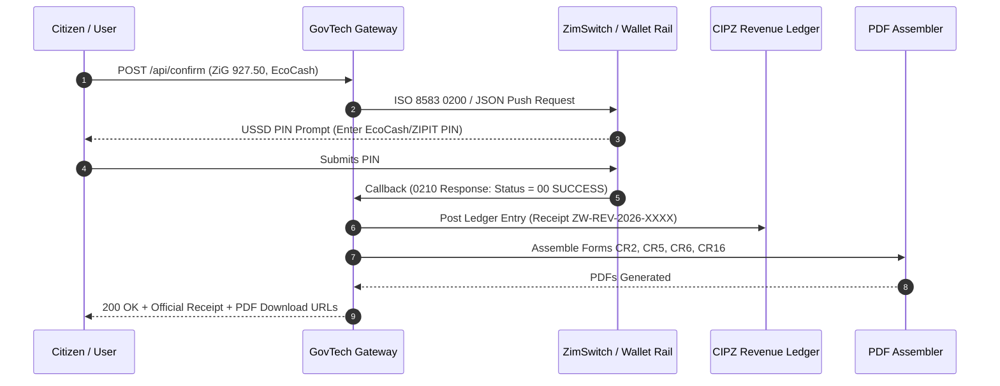

# ZIMSWITCH DUAL-CURRENCY INTEGRATION GUIDE
## Technical Specification for Statutory Multi-Currency Clearing (ZiG & USD)
**Document Version:** 2.4.0  
**Target Environment:** ZimSwitch ZIPIT / ZETSS / EcoCash / InnBucks API Rails  
**Standards:** ISO 8583 (Bitmap Messages) & ISO 20022 (XML/JSON pacs.008, pain.001)

---

### 1. OVERVIEW & CURRENCY SPECIFICATIONS

The GovTech Statutory Platform supports straight-through dual-currency settlement for government fees in compliance with Reserve Bank of Zimbabwe monetary directives.

#### 1.1 Supported ISO Currency Codes
| Currency Name | ISO Alpha Code | ISO Numeric Code | Decimal Precision | Statutory Reference |
|---|---|---|---|---|
| **Zimbabwe Gold (ZiG)** | `ZWG` (or `ZiG`) | `924` | 2 | S.I. 60 of 2024 / Presidential Powers Act |
| **United States Dollar** | `USD` | `840` | 2 | S.I. 218 of 2020 / Multi-Currency Framework |

---

### 2. ARCHITECTURAL TOPOLOGY

```
[Citizen Client]
       │
       ▼ (HTTPS / TLS 1.3)
[GovTech API Gateway: /api/confirm]
       │
       ├─── Currency Routing Engine
       │         │
       │         ├─── If ZWG (924) ───> ZimSwitch ZIPIT API (ISO 8583 MTI 0200)
       │         │                      ├── Primary: Interbank ZIPIT Direct Push
       │         │                      └── Secondary: EcoCash ZiG / O-Mari ZiG
       │         │
       │         └─── If USD (840) ───> Multi-Rail USD Collector
       │                                ├── InnBucks QR / USSD Push
       │                                ├── EcoCash USD (FCA Wallet)
       │                                └── ZimSwitch USD Domestic Card Scheme
       │
       ▼
[Atomic Clearing Callback / Webhook]
       │
       ├── State Transition: PENDING_SETTLEMENT ───> SETTLED
       ├── Vault Audit Log (Encrypted Reference)
       └── Trigger Statutory PDF Generator (Forms CR2, CR5, CR6, CR16)
```

---

### 3. API ENDPOINTS & MESSAGE PROTOCOLS

#### 3.1 Push Payment Initiation Endpoint
- **URL:** `POST https://api.switch.gov.zw/v2/payments/charge`
- **Security:** Mutual TLS (mTLS) + HMAC-SHA256 signature in `X-Signature` header.
- **Idempotency:** Unique `Idempotency-Key` header mandated to prevent duplicate debiting.

#### 3.2 JSON Request Payload Specification
```json
{
  "request_id": "REQ-20261006-881294",
  "client_terminal_id": "ZIMGOV-CIPZ-01",
  "timestamp": "2026-10-06T07:15:00Z",
  "statutory_form_code": "CR_DOSSIER_PACKAGE",
  "payment": {
    "currency_code": "ZWG",
    "currency_numeric": 924,
    "amount": 927.50,
    "exchange_rate": 26.5000,
    "base_usd_amount": 35.00
  },
  "payer": {
    "account_identifier": "0771234567",
    "account_type": "MOBILE_WALLET",
    "channel": "ECOCASH",
    "national_id_blind_index": "a3f5c891e4b2d17882910fae09c84b123d"
  },
  "merchant": {
    "merchant_id": "CIPZ-REV-GOV-ZW",
    "settlement_account": "ZW63CBZ00100984512001",
    "bank_sort_code": "63-001"
  }
}
```

#### 3.3 ISO 8583 Field Mapping (ZimSwitch ZIPIT Message)
When routing across ISO 8583 binary rails, the gateway maps fields as follows:
- **MTI:** `0200` (Financial Transaction Request)
- **Field 3 (Processing Code):** `000000` (Purchase of Goods / Government Service)
- **Field 4 (Amount, Transaction):** `000000092750` (12 numeric characters, 2 decimals implied)
- **Field 7 (Transmission Date & Time):** `MMDDhhmmss`
- **Field 11 (Systems Trace Audit Number - STAN):** 6-digit random integer
- **Field 32 (Acquiring Institution Identification Code):** Assigned ZimSwitch BIN
- **Field 49 (Currency Code, Transaction):** `924` (ZiG) or `840` (USD)
- **Field 102 (Account Identification 1 - Source):** Payer mobile/card token
- **Field 103 (Account Identification 2 - Destination):** CIPZ exchequer account

---

### 4. TRANSACTION WORKFLOW & IDEMPOTENT LIFECYCLE



---

### 5. FAILURE HANDLING, RETRIES & REVERSALS

1. **Timeout Handling:** If the downstream switch does not respond within 30,000 ms, the gateway initiates an automated `0420` Repeat Reversal message.
2. **Idempotency Guard:** If duplicate requests with the same `Idempotency-Key` are received within 24 hours, the gateway returns the cached original result without re-billing the payer.
3. **Escrow Rollback:** If document generation fails following a successful charge, the gateway issues a credit adjustment or holds the credit token for one-click re-generation.

---

### 6. END-OF-DAY RECONCILIATION & SETTLEMENT

1. **Cutoff Time:** 16:00 CAT daily for ZimSwitch ZEES interbank settlement.
2. **Reconciliation Files:** The platform produces an automated ISO 20022 `camt.053` bank statement file detailing:
   - Total ZiG transactions settled
   - Total USD transactions settled
   - CIPZ Statutory sub-ledger breakdown (CR 2 Name Searches vs Incorporation Dossiers)
3. **Audit Trail Retention:** All financial reconciliation logs are preserved in cryptographically signed append-only logs for 7 years under the Public Finance Management Act [Chapter 22:19].
